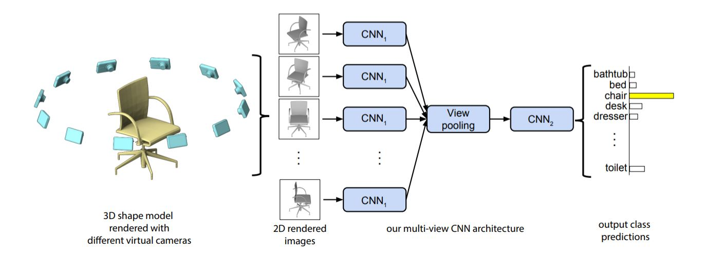

# MVCNN training

Creating, training and evaluating a [Multi-View Convolutional Neural Network](https://arxiv.org/pdf/1505.00880.pdf)



## Resources

* Dataset: [ModelNet40v1](https://drive.uca.fr/d/80ea3fccdd8942c6a062/)
* Workint environment: Ubuntu18.04 LTS / Python 3.6.9 / virtualenv
* Use the `Makefile` commands to:
  * create the project virtual environment
  * print the source terminal command to activate environment in terminal
  * run tensorboard to view training progress & results

## Project structure

```
.
├── data                                # Stores the project data
│   └──modelnet40v1                     # Data folder to be sourced from the link provided in the resources
├── environment                         # Definition and contents of the project virtualenv
├── output                              # Stores model training results
│   └── lightning_logs                  # Generated automatically by pytorch-lightning during training
├── src                                 # Source files of the project
│   ├── dataset_classes                 # Stores classes used in building and managing the project dataset
│   ├── model_classes                   # Stores classes used in building and running the model
│   ├── utilities                       # Stores utility functions and project constants
│   ├── 01_data_analysis.ipynb          # Notebook describing the data used in the MVCNN model training
│   ├── 02_model_training.ipynb         # Notebook describing the assumptions, hyperparameters and the process of the MVCNN model training
│   ├── 03_model_evaluation.ipynb       # Notebook describing the evaluation of the training
│   └── model_training.py               # Script allowing model training from console
├── LICENSE.md                          
├── Makefile                            
└── README.md                           

```